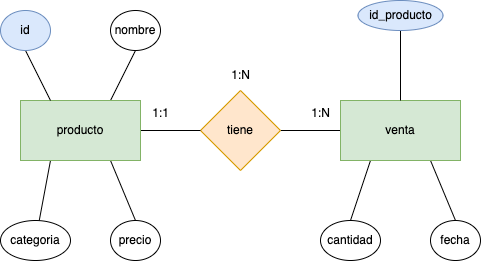
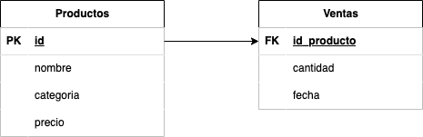

<div align="justify">

# `>_` Tema 3

creación y manipulación de una base de datos SQLite3 desde la línea de comandos_.

## Tarea 4

### Paso 1: Creación de la BBDD

```sh
sqlite3 supermercado-dump.db
SQLite version 3.49.1 2025-02-18 13:38:58
Enter ".help" for usage hints.
sqlite> CREATE TABLE productos (
    id ICREATE TABLE productos (
    id INTEGER PRIMARY KEY,
    nombre TEXT,
    categoria TEXT,
    precio REAL
);

CREATE TABLE ventas (
    id INTEGER PRIMARY KEY,
    id_producto INTEGER,
    cantidad INTEGER,
    fecha DATE,
    FOREIGN KEY (id_producto) REFERENCES productos(id)
);
sqlite> INSERT INTO productos (id, nombre, categoria, precio) VALUES 
    (1, 'Arroz', 'Alimentos', 2.5),
    (2, 'Leche', 'Lácteos', 1.8),
    (3, 'Pan', 'Panadería', 1.2),
    (4, 'Manzanas', 'Frutas', 3.0),
    (5, 'Pollo', 'Carnes', 5.5),
    (6, 'Huevos', 'Lácteos', 1.0),
    (7, 'Yogurt', 'Lácteos', 2.0),
    (8, 'Tomates', 'Verduras', 2.2),
    (9, 'Queso', 'Lácteos', 4.0),
    (10, 'Cereal', 'Desayuno', 3.5),
    (11, 'Papel Higiénico', 'Hogar', 1.5),
    (12, 'Cepillo de Dientes', 'Higiene', 2.0),
    (13, 'Detergente', 'Limpieza', 2.8),
    (14, 'Galletas', 'Snacks', 1.7),
    (15, 'Aceite de Oliva', 'Cocina', 4.5),
    (16, 'Café', 'Bebidas', 5.0),
    (17, 'Sopa enlatada', 'Conservas', 2.3),
    (18, 'Jabón de Baño', 'Higiene', 1.2),
    (19, 'Botellas de Agua', 'Bebidas', 1.0),
    (20, 'Cerveza', 'Bebidas', 3.8);

INSERT INTO ventas (id_producto, cantidad, fecha) VALUES 
    (1, 5, '2024-01-17'),
    (2, 3, '2024-01-17'),
    (4, 2, '2024-01-17'),
    (5, 1, '2024-01-17'),
    (6, 10, '2024-01-18'),
    (8, 4, '2024-01-18'),
    (10, 2, '2024-01-18'),
    (14, 7, '2024-01-19'),
    (16, 3, '2024-01-19'),
    (18, 6, '2024-01-20');
sqllite> SELECT * FROM productos;
+----+--------------------+-----------+--------+
| id |       nombre       | categoria | precio |
+----+--------------------+-----------+--------+
| 1  | Arroz              | Alimentos | 2.5    |
| 2  | Leche              | Lácteos   | 1.8    |
| 3  | Pan                | Panadería | 1.2    |
| 4  | Manzanas           | Frutas    | 3.0    |
| 5  | Pollo              | Carnes    | 5.5    |
| 6  | Huevos             | Lácteos   | 1.0    |
| 7  | Yogurt             | Lácteos   | 2.0    |
| 8  | Tomates            | Verduras  | 2.2    |
| 9  | Queso              | Lácteos   | 4.0    |
| 10 | Cereal             | Desayuno  | 3.5    |
| 11 | Papel Higiénico    | Hogar     | 1.5    |
| 12 | Cepillo de Dientes | Higiene   | 2.0    |
| 13 | Detergente         | Limpieza  | 2.8    |
| 14 | Galletas           | Snacks    | 1.7    |
| 15 | Aceite de Oliva    | Cocina    | 4.5    |
| 16 | Café               | Bebidas   | 5.0    |
| 17 | Sopa enlatada      | Conservas | 2.3    |
| 18 | Jabón de Baño      | Higiene   | 1.2    |
| 19 | Botellas de Agua   | Bebidas   | 1.0    |
| 20 | Cerveza            | Bebidas   | 3.8    |
+----+--------------------+-----------+--------+
sqlite> SELECT * FROM ventas;
+----+-------------+----------+------------+
| id | id_producto | cantidad |   fecha    |
+----+-------------+----------+------------+
| 1  | 1           | 5        | 2024-01-17 |
| 2  | 2           | 3        | 2024-01-17 |
| 3  | 4           | 2        | 2024-01-17 |
| 4  | 5           | 1        | 2024-01-17 |
| 5  | 6           | 10       | 2024-01-18 |
| 6  | 8           | 4        | 2024-01-18 |
| 7  | 10          | 2        | 2024-01-18 |
| 8  | 14          | 7        | 2024-01-19 |
| 9  | 16          | 3        | 2024-01-19 |
| 10 | 18          | 6        | 2024-01-20 |
+----+-------------+----------+------------+
sqlite> .output supermercado-dump.sql
sqlite> .dump
sqlite> .exit

```
  
### Paso 2 Lectura del fichero sql.


```sh
sqlite3 tarea4.db
SQLite version 3.49.1 2025-02-18 13:38:58
Enter ".help" for usage hints.
sqlite> .read supermercado-dump.sql
sqlite> .exit
```

### Paso 3: Responde a las siguientes cuestiones

- Realiza el diagrama __ER__ de la __BBDD__ supermercado.

***


- Realiza el diagrama __MR__ de la __BBDD__ supermercado.
***


***
- Indica si la BBDD esta __normalizada__ hasta la 3ª forma normal, justificando la respuesta.

<h5>

- La base de datos está normalizada hasta la 3ª forma normal porque:

1. Cumple con la 1FN al tener valores atómicos en todas las columnas.

2. Cumple con la 2FN al tener todos los atributos no clave dependiendo completamente de la clave primaria.

3. Cumple con la 3FN al no tener dependencias transitivas en ninguna de las tablas.
</h5>

### Paso 4: Responde a las siguientes cuestiones

Realiza las siguientes consultas, y muestra el resultado obtenido:

- Mostrar todos los productos de la categoría "Bebidas".
```sh
    sqlite> SELECT * FROM productos WHERE categoria = 'Bebidas';
    +----+------------------+-----------+--------+
    | id |      nombre      | categoria | precio |
    +----+------------------+-----------+--------+
    | 16 | Café             | Bebidas   | 5.0    |
    | 19 | Botellas de Agua | Bebidas   | 1.0    |
    | 20 | Cerveza          | Bebidas   | 3.8    |
    +----+------------------+-----------+--------+
```
- Listar los productos ordenados por precio de forma descendente.
```sh
    sqlite> SELECT * FROM productos ORDER BY precio DESC;
    +----+--------------------+-----------+--------+
    | id |       nombre       | categoria | precio |
    +----+--------------------+-----------+--------+
    | 5  | Pollo              | Carnes    | 5.5    |
    | 16 | Café               | Bebidas   | 5.0    |
    | 15 | Aceite de Oliva    | Cocina    | 4.5    |
    | 9  | Queso              | Lácteos   | 4.0    |
    | 20 | Cerveza            | Bebidas   | 3.8    |
    | 10 | Cereal             | Desayuno  | 3.5    |
    | 4  | Manzanas           | Frutas    | 3.0    |
    | 13 | Detergente         | Limpieza  | 2.8    |
    | 1  | Arroz              | Alimentos | 2.5    |
    | 17 | Sopa enlatada      | Conservas | 2.3    |
    | 8  | Tomates            | Verduras  | 2.2    |
    | 7  | Yogurt             | Lácteos   | 2.0    |
    | 12 | Cepillo de Dientes | Higiene   | 2.0    |
    | 2  | Leche              | Lácteos   | 1.8    |
    | 14 | Galletas           | Snacks    | 1.7    |
    | 11 | Papel Higiénico    | Hogar     | 1.5    |
    | 3  | Pan                | Panadería | 1.2    |
    | 18 | Jabón de Baño      | Higiene   | 1.2    |
    | 6  | Huevos             | Lácteos   | 1.0    |
    | 19 | Botellas de Agua   | Bebidas   | 1.0    |
    +----+--------------------+-----------+--------+
    sqlite> 

```

- Calcular el precio total de todos los productos en la tabla "productos".
```sh
    sqlite> SELECT SUM(precio) AS precio_total FROM productos;
    +--------------+
    | precio_total |
    +--------------+
    | 52.5         |
    +--------------+
    sqlite> 

```
- Encontrar los productos con un nombre que contenga la letra 'a'.
```sh
    sqlite> SELECT * FROM productos WHERE nombre REGEXP 'a';
    +----+------------------+-----------+--------+
    | id |      nombre      | categoria | precio |
    +----+------------------+-----------+--------+
    | 3  | Pan              | Panadería | 1.2    |
    | 4  | Manzanas         | Frutas    | 3.0    |
    | 8  | Tomates          | Verduras  | 2.2    |
    | 10 | Cereal           | Desayuno  | 3.5    |
    | 11 | Papel Higiénico  | Hogar     | 1.5    |
    | 14 | Galletas         | Snacks    | 1.7    |
    | 15 | Aceite de Oliva  | Cocina    | 4.5    |
    | 16 | Café             | Bebidas   | 5.0    |
    | 17 | Sopa enlatada    | Conservas | 2.3    |
    | 18 | Jabón de Baño    | Higiene   | 1.2    |
    | 19 | Botellas de Agua | Bebidas   | 1.0    |
    | 20 | Cerveza          | Bebidas   | 3.8    |
    +----+------------------+-----------+--------+
    sqlite> 

```
- Obtener la cantidad total de productos vendidos en todas las fechas.
```sh
    sqlite> SELECT SUM(cantidad) AS total_productos_vendidos FROM ventas;
    +--------------------------+
    | total_productos_vendidos |
    +--------------------------+
    | 43                       |
    +--------------------------+
    sqlite> 
```
- Encontrar el producto más caro en cada categoría.
```sh
    sqlite> SELECT p.categoria, p.nombre, p.precio
    FROM productos p
    JOIN ( SELECT categoria, MAX(precio) AS max_precio
           FROM productos GROUP BY categoria) AS max_precios
    ON p.categoria = max_precios.categoria AND p.precio = max_precios.max_precio;
    +-----------+--------------------+--------+
    | categoria |       nombre       | precio |
    +-----------+--------------------+--------+
    | Alimentos | Arroz              | 2.5    |
    | Panadería | Pan                | 1.2    |
    | Frutas    | Manzanas           | 3.0    |
    | Carnes    | Pollo              | 5.5    |
    | Verduras  | Tomates            | 2.2    |
    | Lácteos   | Queso              | 4.0    |
    | Desayuno  | Cereal             | 3.5    |
    | Hogar     | Papel Higiénico    | 1.5    |
    | Higiene   | Cepillo de Dientes | 2.0    |
    | Limpieza  | Detergente         | 2.8    |
    | Snacks    | Galletas           | 1.7    |
    | Cocina    | Aceite de Oliva    | 4.5    |
    | Bebidas   | Café               | 5.0    |
    | Conservas | Sopa enlatada      | 2.3    |
    +-----------+--------------------+--------+
    sqlite> 

```
- Listar los productos que no han sido vendidos.
```sh
    sqlite> SELECT p.id, p.nombre, p.categoria, p.precio
    FROM productos p
    LEFT JOIN ventas v ON p.id = v.id_producto
    WHERE v.id_producto IS NULL;
    +----+--------------------+-----------+--------+
    | id |       nombre       | categoria | precio |
    +----+--------------------+-----------+--------+
    | 3  | Pan                | Panadería | 1.2    |
    | 7  | Yogurt             | Lácteos   | 2.0    |
    | 9  | Queso              | Lácteos   | 4.0    |
    | 11 | Papel Higiénico    | Hogar     | 1.5    |
    | 12 | Cepillo de Dientes | Higiene   | 2.0    |
    | 13 | Detergente         | Limpieza  | 2.8    |
    | 15 | Aceite de Oliva    | Cocina    | 4.5    |
    | 17 | Sopa enlatada      | Conservas | 2.3    |
    | 19 | Botellas de Agua   | Bebidas   | 1.0    |
    | 20 | Cerveza            | Bebidas   | 3.8    |
    +----+--------------------+-----------+--------+
    sqlite> 
    
```
- Calcular el precio promedio de los productos en la categoría "Snacks".
```sh
    sqlite> SELECT AVG(precio) as precio_promedio_snacks  FROM productos WHERE categoria = 'Snacks';
    +------------------------+
    | precio_promedio_snacks |
    +------------------------+
    | 1.7                    |
    +------------------------+
    sqlite>
```
- Encontrar los productos que han sido vendidos más de 5 veces.
```sh
    sqlite> SELECT 
    p.id, 
    p.nombre, 
    p.categoria, 
    p.precio, 
    SUM(v.cantidad) AS total_vendido
    FROM productos p
    JOIN ventas v ON p.id = v.id_producto
    GROUP BY p.id
    HAVING SUM(v.cantidad) > 5;
    +----+---------------+-----------+--------+---------------+
    | id |    nombre     | categoria | precio | total_vendido |
    +----+---------------+-----------+--------+---------------+
    | 6  | Huevos        | Lácteos   | 1.0    | 10            |
    | 14 | Galletas      | Snacks    | 1.7    | 7             |
    | 18 | Jabón de Baño | Higiene   | 1.2    | 6             |
    +----+---------------+-----------+--------+---------------+
    sqlite> 
```
- Mostrar la fecha y la cantidad de ventas para cada producto.
```sh
    sqlite> SELECT p.nombre, v.fecha, v.cantidad
    FROM productos p
    JOIN ventas v ON p.id = v.id_producto
    ORDER BY p.nombre, v.fecha;
    +---------------+------------+----------+
    |    nombre     |   fecha    | cantidad |
    +---------------+------------+----------+
    | Arroz         | 2024-01-17 | 5        |
    | Café          | 2024-01-19 | 3        |
    | Cereal        | 2024-01-18 | 2        |
    | Galletas      | 2024-01-19 | 7        |
    | Huevos        | 2024-01-18 | 10       |
    | Jabón de Baño | 2024-01-20 | 6        |
    | Leche         | 2024-01-17 | 3        |
    | Manzanas      | 2024-01-17 | 2        |
    | Pollo         | 2024-01-17 | 1        |
    | Tomates       | 2024-01-18 | 4        |
    +---------------+------------+----------+
    sqlite>   
```
- Encontrar los productos que tienen un precio menor o igual a 2.
```sh
    sqlite> SELECT * FROM productos WHERE precio <= 2;
    +----+--------------------+-----------+--------+
    | id |       nombre       | categoria | precio |
    +----+--------------------+-----------+--------+
    | 2  | Leche              | Lácteos   | 1.8    |
    | 3  | Pan                | Panadería | 1.2    |
    | 6  | Huevos             | Lácteos   | 1.0    |
    | 7  | Yogurt             | Lácteos   | 2.0    |
    | 11 | Papel Higiénico    | Hogar     | 1.5    |
    | 12 | Cepillo de Dientes | Higiene   | 2.0    |
    | 14 | Galletas           | Snacks    | 1.7    |
    | 18 | Jabón de Baño      | Higiene   | 1.2    |
    | 19 | Botellas de Agua   | Bebidas   | 1.0    |
    +----+--------------------+-----------+--------+
    sqlite>
```
- Calcular la cantidad total de ventas para cada fecha.
```sh
    sqlite> SELECT fecha, COUNT(*) AS total_ventas FROM ventas GROUP BY fecha ORDER BY fecha;
    +------------+--------------+
    |   fecha    | total_ventas |
    +------------+--------------+
    | 2024-01-17 | 4            |
    | 2024-01-18 | 3            |
    | 2024-01-19 | 2            |
    | 2024-01-20 | 1            |
    +------------+--------------+
    sqlite> 

```
- Listar los productos cuyo nombre comienza con la letra 'P'.
```sh
    sqlite> SELECT * FROM productos WHERE nombre REGEXP '^P';
    +----+-----------------+-----------+--------+
    | id |     nombre      | categoria | precio |
    +----+-----------------+-----------+--------+
    | 3  | Pan             | Panadería | 1.2    |
    | 5  | Pollo           | Carnes    | 5.5    |
    | 11 | Papel Higiénico | Hogar     | 1.5    |
    +----+-----------------+-----------+--------+
    sqlite> 

```
- Obtener el producto más vendido en términos de cantidad.
```sh
    sqlite> SELECT p.id, p.nombre, SUM(v.cantidad) AS total_vendido
    FROM productos p JOIN ventas v ON p.id = v.id_producto
    GROUP BY p.id ORDER BY total_vendido DESC LIMIT 1;
    +----+--------+---------------+
    | id | nombre | total_vendido |
    +----+--------+---------------+
    | 6  | Huevos | 10            |
    +----+--------+---------------+
    sqlite> 
```
- Mostrar los productos que fueron vendidos en la fecha '__2024-01-18__'.
```sh
    sqlite> SELECT p.id, p.nombre, p.categoria, p.precio, v.cantidad
    FROM productos p
    JOIN ventas v ON p.id = v.id_producto
    WHERE v.fecha = '2024-01-18';
    +----+------------------+-----------+--------+----------+
    | id |      nombre      | categoria | precio | cantidad |
    +----+------------------+-----------+--------+----------+
    | 6  | Huevos           | Lácteos   | 1.0    | 10       |
    | 8  | Tomates          | Verduras  | 2.2    | 4        |
    | 10 | Cereal           | Desayuno  | 3.5    | 2        |
    +----+------------------+-----------+--------+----------+
    sqlite>

```
- Calcular el total de ventas para cada producto.
```sh
    sqlite> SELECT p.id, p.nombre, SUM(v.cantidad) AS total_vendido
    FROM productos p
    JOIN ventas v ON p.id = v.id_producto
    GROUP BY p.id;
    +----+--------------------+---------------+
    | id |       nombre       | total_vendido |
    +----+--------------------+---------------+
    | 1  | Arroz              | 5             |
    | 2  | Leche              | 3             |
    | 4  | Manzanas           | 2             |
    | 5  | Pollo              | 1             |
    | 6  | Huevos             | 10            |
    | 8  | Tomates            | 4             |
    | 10 | Cereal             | 2             |
    | 14 | Galletas           | 7             |
    | 16 | Café               | 3             |
    | 18 | Jabón de Baño      | 6             |
    +----+--------------------+---------------+
    sqlite>
```
- Encontrar los productos con un precio entre 3 y 4.

```sh
    sqlite> SELECT * FROM productos WHERE precio BETWEEN 3 AND 4;
    +----+----------+-----------+--------+
    | id |  nombre  | categoria | precio |
    +----+----------+-----------+--------+
    | 4  | Manzanas | Frutas    | 3.0    |
    | 9  | Queso    | Lácteos   | 4.0    |
    | 10 | Cereal   | Desayuno  | 3.5    |
    | 20 | Cerveza  | Bebidas   | 3.8    |
    +----+----------+-----------+--------+
    sqlite> 
```
- Listar los productos y sus categorías ordenados alfabéticamente por categoría.

```sh
    sqlite> SELECT nombre, categoria FROM productos ORDER BY categoria; 
    +--------------------+-----------+
    |       nombre       | categoria |
    +--------------------+-----------+
    | Arroz              | Alimentos |
    | Café               | Bebidas   |
    | Botellas de Agua   | Bebidas   |
    | Cerveza            | Bebidas   |
    | Pollo              | Carnes    |
    | Aceite de Oliva    | Cocina    |
    | Sopa enlatada      | Conservas |
    | Cereal             | Desayuno  |
    | Manzanas           | Frutas    |
    | Cepillo de Dientes | Higiene   |
    | Jabón de Baño      | Higiene   |
    | Papel Higiénico    | Hogar     |
    | Detergente         | Limpieza  |
    | Leche              | Lácteos   |
    | Huevos             | Lácteos   |
    | Yogurt             | Lácteos   |
    | Queso              | Lácteos   |
    | Pan                | Panadería |
    | Galletas           | Snacks    |
    | Tomates            | Verduras  |
    +--------------------+-----------+
    sqlite> 

```
- Calcular el precio total de los productos vendidos en la fecha '2024-01-19'.

```sh
    sqlite> SELECT SUM(p.precio * v.cantidad) AS precio_total FROM productos p JOIN ventas v ON p.id = v.id_producto WHERE v.fecha = '2024-01-19';
    +--------------+
    | precio_total |
    +--------------+
    | 26.9         |
    +--------------+
    sqlite> 
```
- Mostrar los productos que no pertenecen a la categoría "__Higiene__".

```sh
    sqlite> SELECT * FROM productos WHERE categoria = 'Higiene';
    +----+--------------------+-----------+--------+
    | id |       nombre       | categoria | precio |
    +----+--------------------+-----------+--------+
    | 12 | Cepillo de Dientes | Higiene   | 2.0    |
    | 18 | Jabón de Baño      | Higiene   | 1.2    |
    +----+--------------------+-----------+--------+
    sqlite> 
```
- Encontrar la cantidad total de productos en cada categoría.

```sh
    sqlite> SELECT categoria, COUNT(*) AS cantidad FROM productos GROUP BY categoria;
    +-----------+----------+
    | categoria | cantidad |
    +-----------+----------+
    | Alimentos | 1        |
    | Bebidas   | 3        |
    | Carnes    | 1        |
    | Cocina    | 1        |
    | Conservas | 1        |
    | Desayuno  | 1        |
    | Frutas    | 1        |
    | Higiene   | 2        |
    | Hogar     | 1        |
    | Limpieza  | 1        |
    | Lácteos   | 4        |
    | Panadería | 1        |
    | Snacks    | 1        |
    | Verduras  | 1        |
    +-----------+----------+
    sqlite> 

```
- Listar los productos que tienen un precio igual a la media de precios.

> NINGUN PRODUCTO CUMPLE ESTA CONDICION POR ESO NO SE DEVUELVE NADA
```sh
    sqlite> SELECT * FROM productos WHERE precio = (SELECT AVG(precio) FROM productos);
    sqlite>
```
- Calcular el precio total de los productos vendidos en cada fecha.

```sh
    sqlite> SELECT fecha, SUM(p.precio * v.cantidad) AS total_precio FROM productos p JOIN ventas v ON p.id = v.id_producto GROUP BY fecha;
    +------------+--------------+
    |   fecha    | total_precio |
    +------------+--------------+
    | 2024-01-17 | 29.4         |
    | 2024-01-18 | 25.8         |
    | 2024-01-19 | 26.9         |
    | 2024-01-20 | 7.2          |
    +------------+--------------+
    sqlite> 
```
- Mostrar los productos con un nombre que termina con la letra 'o'.

```sh
    sqlite> SELECT * FROM productos WHERE nombre REGEXP 'o$';
    +----+-----------------+-----------+--------+
    | id |     nombre      | categoria | precio |
    +----+-----------------+-----------+--------+
    | 5  | Pollo           | Carnes    | 5.5    |
    | 9  | Queso           | Lácteos   | 4.0    |
    | 11 | Papel Higiénico | Hogar     | 1.5    |
    | 18 | Jabón de Baño   | Higiene   | 1.2    |
    +----+-----------------+-----------+--------+
    sqlite> 
```
- Encontrar los productos que han sido vendidos en más de una fecha.
> NINGUN PRODUCTO CUMPLE ESTA CONDICION POR ESO NO SE DEVUELVE NADA
```sh
    sqlite> SELECT p.id, p.nombre, p.categoria, COUNT(DISTINCT v.fecha) AS total_fechas_vendidas FROM productos p JOIN ventas v ON p.id = v.id_producto GROUP BY p.id HAVING COUNT(DISTINCT v.fecha) > 1;
    sqlite> 
    
```
- Listar los productos cuya categoría comienza con la letra 'L'.

```sh
    sqlite> SELECT * FROM productos WHERE categoria REGEXP '^L';
    +----+------------+-----------+--------+
    | id |   nombre   | categoria | precio |
    +----+------------+-----------+--------+
    | 2  | Leche      | Lácteos   | 1.8    |
    | 6  | Huevos     | Lácteos   | 1.0    |
    | 7  | Yogurt     | Lácteos   | 2.0    |
    | 9  | Queso      | Lácteos   | 4.0    |
    | 13 | Detergente | Limpieza  | 2.8    |
    +----+------------+-----------+--------+
```
- Calcular el total de ventas para cada producto en la fecha '2024-01-17'.

```sh

    sqlite> SELECT p.id, p.nombre, p.categoria, SUM(v.cantidad) AS total_vendido FROM productos p JOIN ventas v ON p.id = v.id_producto WHERE v.fecha = '2024-01-17' GROUP BY p.id;
    +----+----------+-----------+---------------+
    | id |  nombre  | categoria | total_vendido |
    +----+----------+-----------+---------------+
    | 1  | Arroz    | Alimentos | 5             |
    | 2  | Leche    | Lácteos   | 3             |
    | 4  | Manzanas | Frutas    | 2             |
    | 5  | Pollo    | Carnes    | 1             |
    +----+----------+-----------+---------------+
    sqlite> 

```
- Mostrar los productos cuyo nombre tiene al menos 5 caracteres.

```sh
    sqlite> SELECT * FROM productos WHERE LENGTH(nombre) >= 5;
    +----+--------------------+-----------+--------+
    | id |       nombre       | categoria | precio |
    +----+--------------------+-----------+--------+
    | 1  | Arroz              | Alimentos | 2.5    |
    | 2  | Leche              | Lácteos   | 1.8    |
    | 4  | Manzanas           | Frutas    | 3.0    |
    | 5  | Pollo              | Carnes    | 5.5    |
    | 6  | Huevos             | Lácteos   | 1.0    |
    | 7  | Yogurt             | Lácteos   | 2.0    |
    | 8  | Tomates            | Verduras  | 2.2    |
    | 9  | Queso              | Lácteos   | 4.0    |
    | 10 | Cereal             | Desayuno  | 3.5    |
    | 11 | Papel Higiénico    | Hogar     | 1.5    |
    | 12 | Cepillo de Dientes | Higiene   | 2.0    |
    | 13 | Detergente         | Limpieza  | 2.8    |
    | 14 | Galletas           | Snacks    | 1.7    |
    | 15 | Aceite de Oliva    | Cocina    | 4.5    |
    | 17 | Sopa enlatada      | Conservas | 2.3    |
    | 18 | Jabón de Baño      | Higiene   | 1.2    |
    | 19 | Botellas de Agua   | Bebidas   | 1.0    |
    | 20 | Cerveza            | Bebidas   | 3.8    |
    +----+--------------------+-----------+--------+
    sqlite> 

```
- Encontrar los productos que tienen un precio superior al precio máximo en la tabla "__productos__".

```sh
    sqlite> SELECT id, nombre, categoria, precio FROM productos WHERE precio = (SELECT MAX(precio) FROM productos);
    +----+--------+-----------+--------+
    | id | nombre | categoria | precio |
    +----+--------+-----------+--------+
    | 5  | Pollo  | Carnes    | 5.5    |
    +----+--------+-----------+--------+
    sqlite> 
```


</div>
