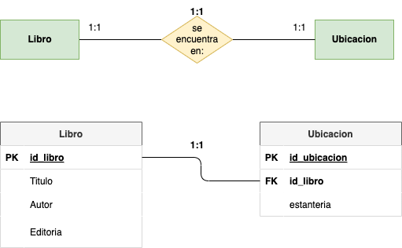

# Tarea 3

## Descripción

Representa las entidades, relaciones y cardinalidades mínimas y máximas para cada uno de los siguientes supuestos:

- Ejercicio 1:

En un sistema de biblioteca, cada libro tiene un número único de identificación (ID). Se requiere almacenar información adicional sobre la ubicación de cada libro (como la estantería), y esta información solo se puede asociar con un libro en particular. Diseña las tablas y define la relación entre ellas.

  

      
PULSA PARA VER MI RESPUESTA

   
  
   

 
     

 
