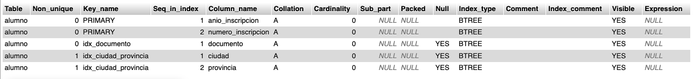

# 🧮 Tarea 1 – Trabajo con Índices (Tabla `alumno`)

Una institución guarda los siguientes datos de sus alumnos:

- Número de inscripción (comienza desde 1 cada año)
- Año de inscripción
- Nombre del alumno
- Documento del alumno
- Domicilio
- Ciudad
- Provincia

🔑 **Clave primaria compuesta**: `(año de inscripción, número de inscripción)`

---

## 1. Eliminar la tabla `alumno` si existe

```sql
DROP TABLE IF EXISTS alumno;
```

**Salida:**
```
 MySQL ha devuelto un conjunto de valores vacío (es decir: cero columnas). (La consulta tardó 0.00005 segundos.)
```

---

## 2. Crear tabla `alumno` con clave primaria compuesta

```sql
CREATE TABLE alumno (
    numero_inscripcion INT NOT NULL,
    anio_inscripcion INT NOT NULL,
    nombre VARCHAR(50),
    documento VARCHAR(15),
    domicilio VARCHAR(50),
    ciudad VARCHAR(30),
    provincia VARCHAR(30),
    PRIMARY KEY (anio_inscripcion, numero_inscripcion)
);
```

**Salida:**
```
 MySQL ha devuelto un conjunto de valores vacío (es decir: cero columnas). (La consulta tardó 0.00034 segundos.)
```

---

## 3. Crear índices

```sql
-- Índice único para evitar duplicados en documento
CREATE UNIQUE INDEX idx_documento ON alumno(documento);

-- Índice común para mejorar búsquedas por ciudad y provincia
CREATE INDEX idx_ciudad_provincia ON alumno(ciudad, provincia);
```

**Salida:**
```
 MySQL ha devuelto un conjunto de valores vacío (es decir: cero columnas). (La consulta tardó 0.00073 segundos.)
```

**Justificación:**
- `UNIQUE` en `documento`: evita duplicados de identificación.
- Índice común en `ciudad, provincia`: mejora búsquedas por ubicación.

---

## 4. Ver los índices de la tabla

```sql
SHOW INDEX FROM alumno;
```

**Salida:**
```
Muestra los índices creados, incluyendo PRIMARY, UNIQUE y el índice común.
{TE MUESTRO UNA CAPTURA PARA NO TENER QUE CREAR LA TABLA DE CERO YA QUE MYSQL NO DEJA COPIARLA}
```


---

## 5. Insertar un alumno con clave primaria repetida

```sql
INSERT INTO alumno VALUES (1, 2024, 'Maria', '12345678', 'Calle Falsa 123', 'TNF', 'TNF');
INSERT INTO alumno VALUES (1, 2024, 'Jose', '87654321', 'Otra Calle 456', 'TNF', 'TNF');
```

**Salida:**
```
Error
consulta SQL: Copiar


INSERT INTO alumno VALUES (1, 2024, 'Jose', '87654321', 'Otra Calle 456', 'TNF', 'TNF');
MySQL ha dicho: Documentación

#1062 - Entrada duplicada '2024-1' para la clave 'alumno.PRIMARY'
```

---

## 6. Insertar un alumno con documento repetido

```sql
INSERT INTO alumno VALUES (2, 2024, 'Pepe', '12345678', 'Calle 789', 'Madrid', 'Madrid');
```

**Salida:**
```
Error
consulta SQL: Copiar


INSERT INTO alumno VALUES (2, 2024, 'Pepe', '12345678', 'Calle 789', 'Madrid', 'Madrid');
MySQL ha dicho: Documentación

#1062 - Entrada duplicada '12345678' para la clave 'alumno.idx_documento'
```

---

## 7. Insertar varios alumnos con misma ciudad y provincia

```sql
INSERT INTO alumno VALUES (2, 2024, 'Laura', '11223344', 'Calle Luna', 'Sevilla', 'Sevilla');
INSERT INTO alumno VALUES (3, 2024, 'Carlos', '22334455', 'Calle Sol', 'Sevilla', 'Sevilla');
```

**Salida:**
```
 1 fila insertada. (La consulta tardó 0.0003 segundos.)
 1 fila insertada. (La consulta tardó 0.0004 segundos.)
```

---

## 8. Eliminar los índices creados

```sql
DROP INDEX idx_documento ON alumno;
DROP INDEX idx_ciudad_provincia ON alumno;
```

**Salida:**
```
 MySQL ha devuelto un conjunto de valores vacío (es decir: cero columnas). (La consulta tardó 0.00068 segundos.)
 MySQL ha devuelto un conjunto de valores vacío (es decir: cero columnas). (La consulta tardó 0.00030 segundos.)

```

---

## 9. Verificar que ya no existen índices

```sql
SHOW INDEX FROM alumno;
```

**Salida:**
```
Solo queda el índice de clave primaria
```

