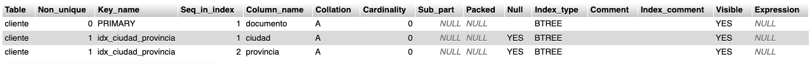
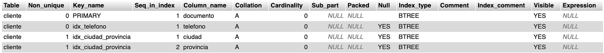

# 🧮 Tarea 2 – Trabajo con Índices (Tabla `cliente`)

La empresa guarda la siguiente información de sus clientes:

- Documento (char(8) NOT NULL)
- Nombre (varchar(30) NOT NULL)
- Domicilio
- Ciudad
- Provincia
- Teléfono

---

## 1. Eliminar la tabla `cliente` si existe

```sql
DROP TABLE IF EXISTS cliente;
```

**Salida:**
```
 MySQL ha devuelto un conjunto de valores vacío (es decir: cero columnas). (La consulta tardó 0.00011 segundos.)
```

---

## 2. Crear tabla sin clave primaria y agregarla después

```sql
CREATE TABLE cliente (
    documento CHAR(8) NOT NULL,
    nombre VARCHAR(30) NOT NULL,
    domicilio VARCHAR(30),
    ciudad VARCHAR(20),
    provincia VARCHAR(20),
    telefono VARCHAR(11)
);
```

**Salida:**
```
 MySQL ha devuelto un conjunto de valores vacío (es decir: cero columnas). (La consulta tardó 0.00051 segundos.)
```

**Agregar clave primaria:**

```sql
ALTER TABLE cliente ADD PRIMARY KEY (documento);
```

**Salida:**
```
 MySQL ha devuelto un conjunto de valores vacío (es decir: cero columnas). (La consulta tardó 0.0101 segundos.)
```

---

## 3. Crear índices

```sql
-- Ya es PRIMARY KEY, por lo que el índice único en documento es innecesario si ya se aplicó.

-- Índice común por ciudad y provincia para mejorar filtros por ubicación
CREATE INDEX idx_ciudad_provincia ON cliente(ciudad, provincia);
```

**Salida:**
```
 MySQL ha devuelto un conjunto de valores vacío (es decir: cero columnas). (La consulta tardó 0.0028 segundos.)
```

**Justificación:**
- El índice compuesto en `ciudad` y `provincia` acelera búsquedas por zona geográfica.

---

## 4. Ver los índices de la tabla

```sql
SHOW INDEX FROM cliente;
```

**Salida:**
```
Incluye PRIMARY y el índice idx_ciudad_provincia
```


---

## 5. Crear índice único por teléfono

```sql
CREATE UNIQUE INDEX idx_telefono ON cliente(telefono);
```

**Salida:**
```
 MySQL ha devuelto un conjunto de valores vacío (es decir: cero columnas). (La consulta tardó 0.0051 segundos.)
```


---

## 6. Eliminar los índices

```sql
DROP INDEX idx_ciudad_provincia ON cliente;
DROP INDEX idx_telefono ON cliente;
```

**Salida:**
```
 MySQL ha devuelto un conjunto de valores vacío (es decir: cero columnas). (La consulta tardó 0.0025 segundos.)
 MySQL ha devuelto un conjunto de valores vacío (es decir: cero columnas). (La consulta tardó 0.0014 segundos.)
```

**Eliminar clave primaria (opcional):**

```sql
ALTER TABLE cliente DROP PRIMARY KEY;
```

**Salida:**
```
 MySQL ha devuelto un conjunto de valores vacío (es decir: cero columnas). (La consulta tardó 0.0113 segundos.)
```

---

## 7. Verificar que no existen índices

```sql
SHOW INDEX FROM cliente;
```

**Salida:**
```
 MySQL ha devuelto un conjunto de valores vacío (es decir: cero columnas). (La consulta tardó 0.0011 segundos.)
 
```
